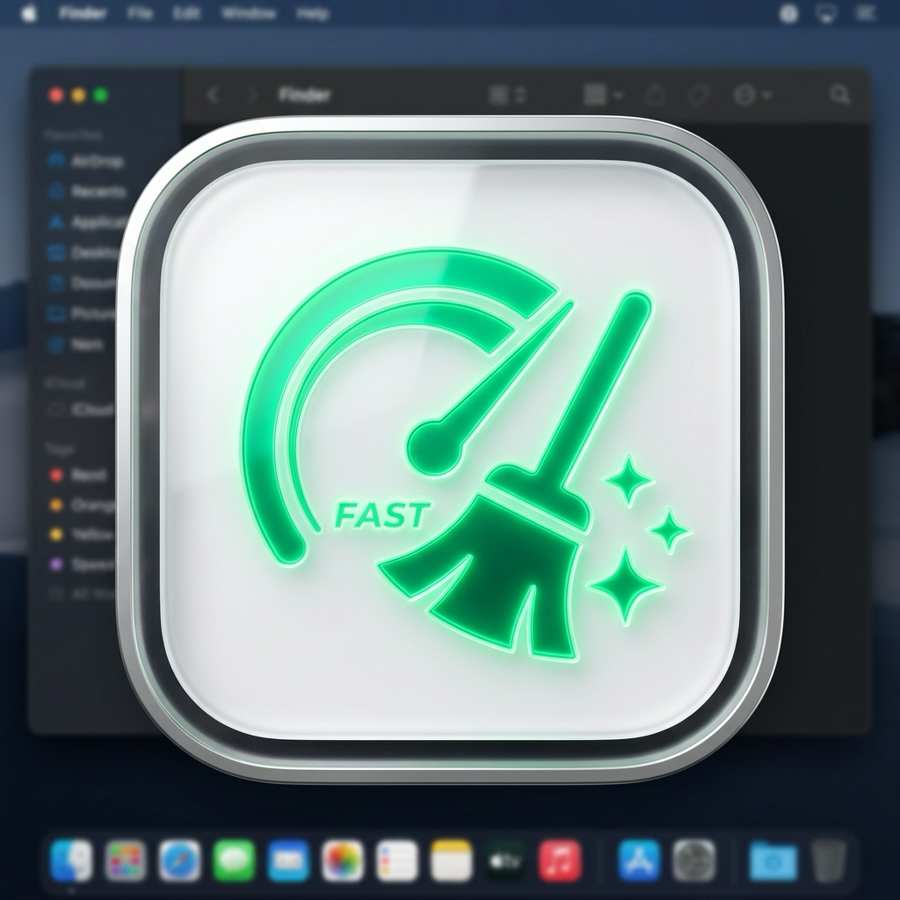

<div align="center">



# ⚡ Mac Clean Optimizer (Lab98 Studio Edition) v1.6.0

**macOS 전용 프리미엄 고성능 시스템 최적화, 디스크 정리, 자원 가드 및 개인정보 보호 종합 툴키트**

[](https://www.apple.com/macos)
[](https://swift.org)
[](Tests)
[](https://github.com/crazy-vincnet/MacOptimizationTool/releases)
[](LICENSE)

---

</div>

## 📖 목차 (Table of Contents)
1. [주요 기능 소개 (Core Features)](#-주요-기능-소개-core-features)
2. [안전성 설계 (Safety Design)](#%EF%B8%8F-안전성-설계-safety-design)
3. [빌드 · 테스트 · 배포 (Build, Test & Deployment)](#%EF%B8%8F-빌드--테스트--배포-build-test--deployment)
4. [프로젝트 구조 (Project Structure)](#-프로젝트-디렉토리-구조-project-structure)
5. [변경 이력 (Changelog)](#-변경-이력-changelog)
6. [라이선스 및 저작권 (License & Copyright)](#-라이선스-및-저작권-license--copyright)

> **v1.6.0 릴리스 안내** — 보안 결함 3건과 버그 8건을 수정하고, SwiftPM 전환·단위 테스트 56개·CI를 도입했습니다.
> 전체 감사 내역은 [`CODE_REVIEW.md`](CODE_REVIEW.md), 변경 요약은 [`CHANGELOG.md`](CHANGELOG.md) 를 참고하세요.

---

## 📌 주요 기능 소개 (Core Features)

### 📊 1. 실시간 시스템 대시보드 & 자원 가드 (Real-time Dashboard & Resource Guard)
- **1초 단위 실시간 자원 감시**: CPU 사용량, GPU 로드, RAM(앱/Wired/압축 메모리), 디스크 여유 공간, 시스템 온도 및 배터리 전원 상태 실시간 표시.
- **원클릭 메모리 즉시 최적화**: macOS 빌트인 `purge` 기법과 연결하여 비활성 메모리 및 캐시 영역을 원클릭으로 안전 환수.
- **프로세스 폭주 파수꾼 (`ProcessGuardManager`)**: CPU 점유율 85% 이상 독점 앱 실시간 감지 및 경고 팝업, 원클릭 강제 종료 기능 제공.

### 🛡️ 2. 시스템 전체 디스크 접근 권한 온보딩 (Full Disk Access Onboarding)
- **TCC `FileHandle` 정밀 샌드박스 검사기 (`PermissionManager`)**: POSIX chmod 체크 대신 실시간 TCC 샌드박스 오픈 테스트를 통해 권한 부여 상태를 정확하게 판별.
- **차단형 온보딩 팝업 (`PermissionModalView`)**: 필수 권한(전체 디스크 접근 권한) 미승인 시 앱 접근을 안전하게 보호하고 안내.
- **프로세스 자동 재시작 & 수동 우회 버튼**:
  - `[앱 자동 재시작]`: macOS TCC 권한 토큰 즉시 반영을 위해 앱을 자동 종료 후 재실행.
  - `[권한 부여 완료 • 바로 시작하기]`: 수동 권한 스위치를 켠 경우 재시작 없이 즉시 앱 메인 화면 진입.

### 🛑 3. 전 기능 비동기 스캔 즉시 취소 (Scan Cancellation)
- **전 스캔 카드 [스캔 취소] 연동**: 중복 파일, 대용량 파일, 시스템 정크 디스크 청소, 방치된 다운로드, 브라우저 개인정보 정리 등 모든 스캔 카드 오버레이에 스캔 취소 버튼 연결.
- **Swift Concurrency `Task.cancel()` 엔진**: 탐색 수행 중 사용자가 취소 시 백그라운드 태스크를 즉시 중단하고 안전하게 이전 UI 상태로 복구.

### ⚡ 4. 16-Worker 병렬 해시 & 초고속 다운로드 분류기
- **`maxConcurrency = 16` 슬라이딩 윈도우 해시**: 중복 파일 비교 시 1차 고속 이진 해시 비교를 16개 전용 async 워커로 가속하여 디스크 I/O 교착상태 방지.
- **`~/Downloads` 0.001초 분류기**: `.skipsSubdirectoryDescendants` 옵션을 적용하여 다운로드 폴더 1단계 직속 파일만 초고속 탐색.

### 🗑️ 5. 4단계 스마트 앱 완전 삭제기 (4-Tier Smart Uninstaller)
- **Pre-Authorization 사전 권한 검증 (`FileSafety.deleteBatch`)**: 삭제 전 관리자 권한 필요 여부를 사전 점검하여, 비밀번호 오입력 시 앱이나 파일이 지워지는 오작동 완벽 차단.
- **4단계 폴백 삭제 엔진**: `Trash` ➔ `NSWorkspace` ➔ `Direct Delete` ➔ `Admin Elevation (with administrator privileges)`.
- **드롭존 1초 추적**: 앱 아이콘을 드롭존에 놓으면 `Application Support`, `Caches`, `Preferences` 잔여 찌꺼기 파일까지 완벽 추적.

### 🔒 6. 브라우저 개인정보 및 웹 찌꺼기 수거기 (Privacy Cleaner)
- **다중 브라우저 통합 수거**: Safari, Chrome, Edge, Firefox, Brave 웹 캐시, 쿠키, 로컬 스토리지, Favicon 캐시 탐색 및 안전 청소.

### 🌐 7. 4개 국어 완전 지원 (Full Localization)
- **한국어 / English / 简体中文 / 日本語**: 모든 화면, 진행 상태 문구, 알림, 경고 메시지가 번역됩니다.
- **시스템 언어 자동 감지**: 설정에서 언어를 고정하거나 macOS 시스템 언어를 따르도록 선택할 수 있습니다.
- **번역 정합성 자동 검증**: 언어별 키 집합 일치와 포맷 지정자 개수 일치를 단위 테스트가 상시 검사합니다.

### 🚀 8. 무결성 검증 인앱 자동 업데이트 (Verified In-App Updater)
- **GitHub Release 스트리밍 다운로드**: 릴리스 자산(.dmg)을 인앱으로 직접 수신 (`SparkleUpdaterManager`).
- **HTTPS + 호스트 허용목록**: `github.com` / `objects.githubusercontent.com` 등 지정된 배포 호스트로만 접속한다.
- **SHA-256 무결성 검증**: 내려받은 파일 해시를 GitHub Release API 의 자산 다이제스트와 대조하고, **일치할 때만** 자동 마운트한다. 검증 해시가 없거나 불일치하면 자동 설치를 중단하고 릴리스 페이지를 연다.
- **실시간 진행률 프로그레스바**: 다운로드 진행 현황을 `(15.4 MB / 48.2 MB - 32%)`와 같이 실시간 표출.

---

## 🛡️ 안전성 설계 (Safety Design)

이 앱은 사용자 파일을 삭제하고 관리자 권한을 사용합니다. 그만큼 "지우면 안 되는 것을 지우지 않는" 규칙이 기능보다 중요합니다.
v1.6.0에서 아래 규칙을 명문화하고 단위 테스트로 고정했습니다.

### 삭제 보호 계층

| 계층 | 규칙 |
|---|---|
| 정확 일치 보호 | `/`, `/System`, `/Library`, `/usr`, `/bin`, `/etc`, `/Applications`, 홈 디렉터리 및 홈 최상위 폴더는 삭제 대상이 될 수 없습니다. |
| 트리 보호 | 시스템 트리(`/System`, `/usr`, `/private`, `/etc` 등)는 하위 항목까지 차단합니다. 경로 접두사 비교가 아닌 경계 단위 비교라 `/usrdata` 같은 이름은 오차단되지 않습니다. |
| 심볼릭 링크 해석 | 모든 판정은 심볼릭 링크를 해석하고 경로를 표준화한 뒤 수행합니다. |
| 관리자 권한 화이트리스트 | `/Library` 하위 중 앱 잔여물이 실제로 존재하는 트리의 **하위 항목만** 관리자 권한 삭제 대상이며, 각 트리의 루트 자체는 제외됩니다. |

관리자 권한 삭제가 허용되는 트리: `Application Support`, `Caches`, `Logs`, `Preferences`, `LaunchAgents`, `LaunchDaemons`, `PrivilegedHelperTools`, `Containers`, `Saved Application State`, `Internet Plug-Ins`

### 명령 실행 이스케이프

관리자 권한 삭제는 `do shell script "..." with administrator privileges` 를 사용합니다.
이 경로는 **AppleScript 문자열 파싱 → 셸 파싱** 두 단계를 거치므로, 두 레이어를 모두 이스케이프해야 합니다.

```swift
// 1) 셸 단어로 안전하게 감싸고
let quoted = shellQuoted(path)              // '...'  (내부 ' 는 '''  로 치환)
// 2) AppleScript 문자열로 다시 이스케이프한다 (백슬래시를 반드시 먼저)
let literal = appleScriptStringLiteral(cmd) // \ 먼저, 그다음 "
```

제어 문자(`
`, `` 등)가 포함된 경로는 어떤 이스케이프로도 안전을 보장할 수 없으므로 삭제 자체를 거부합니다.

### 사전 인증 (Pre-Authorization)

앱 완전 삭제 시 관리자 권한이 필요한 항목이 하나라도 있으면 **삭제를 시작하기 전에** 인증을 요구합니다.
비밀번호를 틀리거나 취소하면 앱 본체를 포함해 **어떤 파일도 삭제하지 않고** 전체 작업을 중단합니다.

### 업데이트 신뢰 사슬

```
GitHub Release API (HTTPS)
        │  자산 목록 + sha256 다이제스트
        ▼
호스트 허용목록 검사 ──▶ 불일치 시 중단
        │
        ▼
DMG 스트리밍 다운로드
        │
        ▼
파일 SHA-256 계산 ──▶ 다이제스트와 불일치 / 다이제스트 없음 ──▶ 자동 설치 중단, 릴리스 페이지 열기
        │  일치
        ▼
hdiutil attach (마운트)
```

### 측정값에 대한 원칙

커널 통계 조회에 실패하면 추정값을 만들어내지 않고 실패로 표시합니다(메뉴바는 `--`).
모니터링 도구가 조용히 거짓 수치를 보여주는 것이 수치가 비어 있는 것보다 위험하기 때문입니다.

---

## 🛠️ 빌드 · 테스트 · 배포 (Build, Test & Deployment)

요구 사항: macOS 13.0 이상, Swift 6 툴체인(Xcode 16 또는 Command Line Tools).

프로젝트 루트의 자동화 빌드 스크립트를 통해 원클릭으로 실행 파일 및 설치 패키지를 생성할 수 있습니다:

### 1. 로컬 개발 및 앱 실행
```bash
./build.sh
```
SwiftPM 릴리스 빌드(`swift build -c release`), `xattr` 정리, ad-hoc 코드 서명 후 `MacOptimizationTool.app`을 실행합니다.
`--no-run` 을 붙이면 실행 없이 패키징만 수행합니다.

### 1-1. 단위 테스트
```bash
./test.sh
```
`MacOptimizationCore` 모듈의 swift-testing 스위트를 실행합니다. Xcode 없이 Command Line Tools 만 설치된 환경도 자동 감지해 동작합니다.
삭제 안전 규칙, 잔여물 매칭 오탐, 업데이트 검증, 번역 사전 정합성이 테스트 대상입니다.

### 2. 웹 배포용 `.dmg` 디스크 이미지 패키징
```bash
./build_dmg.sh
```
드래그 앤 드롭 `/Applications` 설치 폴더가 포함된 `MacOptimizationTool_Setup.dmg` 이미지를 생성합니다.

### 3. GitHub Release 자동 게시
```bash
./release.sh v1.6.0 "릴리즈 노트 내용"
```
버전 커밋, Git 태그 생성, DMG 패키징, `gh release create`를 통해 GitHub Release 게시 및 DMG 첨부를 자동 진행합니다.
릴리스 노트에는 DMG 의 SHA-256 체크섬이 함께 게시되며, 인앱 업데이터는 이 값으로 무결성을 검증합니다.

### ⚠️ 코드 서명과 샌드박스에 관한 안내
- 직접 배포(`build.sh` / `build_dmg.sh`)는 `MacOptimizationTool.entitlements`(비샌드박스)로 서명합니다.
- 이 앱은 전체 디스크 접근 권한으로 `/Library`·`~/Library` 를 스캔하고 `purge`·`ps`·`hdiutil` 을 실행하며 관리자 권한 삭제에 AppleScript 를 사용하므로 **App Sandbox 와 호환되지 않습니다.**
- `build_appstore_package.sh` 는 `MacCleanOptimizer.entitlements`(샌드박스)로 서명하며, 이 구성에서는 `/Library` 스캔·관리자 삭제·프로세스 감시 기능이 동작하지 않습니다.

---

## 📁 프로젝트 디렉토리 구조 (Project Structure)

```
MacOptimizationTool/
├── Package.swift                  # SwiftPM 매니페스트 (Core / App / Tests 3개 타깃)
├── Sources/
│   ├── MacOptimizationCore/       # UI 비의존 로직 (테스트 대상 모듈)
│   │   ├── FileSafety.swift           # 보호 경로 규칙 + 셸/AppleScript 이중 이스케이프 삭제 엔진
│   │   ├── LeftoverMatcher.swift      # 앱 잔여물 매칭 규칙 (오탐 방지)
│   │   ├── UpdateVerification.swift   # 버전 비교 · 호스트 허용목록 · SHA-256 검증
│   │   ├── HardwareStatsHelper.swift  # CPU/RAM 텔레메트리 (측정 실패 시 nil)
│   │   ├── LanguageManager.swift      # 4개 국어 번역 관리자 (스레드 안전)
│   │   ├── GeneratedTranslations.swift    # 자동 생성 번역 사전
│   │   └── AdditionalTranslations.swift   # 뷰 문자열 통합 번역 사전
│   └── MacOptimizationTool/       # SwiftUI 앱 본체 (@main)
│       ├── App.swift                  # AppDelegate 및 포그라운드 알림 연동
│       ├── MainView.swift             # 메인 레이아웃 및 서브 탭 라우팅
│       ├── PermissionManager.swift    # FDA (필수) & 알림 (선택) TCC 검사 엔진
│       ├── PermissionModalView.swift  # Glassmorphism 권한 안내 온보딩 모달
│       ├── DashboardView.swift        # 실시간 자원 대시보드 뷰
│       ├── UninstallerView.swift      # 앱 완전 삭제기 뷰 & 드롭존
│       ├── UninstallerViewModel.swift # 4단계 삭제 및 찌꺼기 추적 모델
│       ├── DiskCleanerView.swift      # 캐시 & 로그 디스크 정리기
│       ├── LargeFilesView.swift       # 대용량 방치 파일 검사기
│       ├── DuplicateView.swift        # 16-Worker 중복 파일 이진 해시 비교기
│       ├── PrivacyCleanerView.swift   # 브라우저 개인정보 수거기
│       ├── OldDownloadsView.swift     # 방치 다운로드 분류기
│       ├── ProcessGuardManager.swift  # 프로세스 자원 폭주 감시기
│       ├── SparkleUpdaterManager.swift# SHA-256 검증 인앱 업데이터
│       ├── SettingsView.swift         # 스튜디오 통합 설정 뷰
│       └── Theme.swift                # dynamicProvider 기반 디자인 토큰
├── Tests/MacOptimizationCoreTests/    # swift-testing 단위 테스트 (56개)
├── .github/workflows/ci.yml       # 빌드 + 테스트 + 서명 검증 CI
├── docs/                          # GitHub Pages Landing Website
│   ├── index.html                 # 모던 웹 디자인 사이트 (HTML/CSS/JS)
│   ├── screenshot_dashboard.jpg   # 대시보드 실제 구동 스크린샷
│   └── AppIcon.png                # 웹 브랜딩 아이콘 자산
├── AppIcon.icns                   # 1024x1024 멀티레이어 아이콘
├── CODE_REVIEW.md                 # 전체 코드 분석 리포트 및 조치 내역
├── LICENSE                        # MIT 라이선스 전문
├── MacOptimizationTool.entitlements  # 직접 배포용 (비샌드박스) entitlements
├── MacCleanOptimizer.entitlements    # Mac App Store 제출용 (샌드박스) entitlements
├── build.sh                       # SwiftPM 릴리스 빌드 & .app 패키징 & 서명
├── build_dmg.sh                   # DMG 디스크 이미지 패키징 스크립트
├── test.sh                        # 단위 테스트 실행 (Xcode 없이도 동작)
├── release.sh                     # GitHub Release 자동화 스크립트
└── README.md                      # 프로젝트 공식 설명서
```

---

## 📝 변경 이력 (Changelog)

버전별 상세 변경 사항은 [`CHANGELOG.md`](CHANGELOG.md) 에 정리되어 있습니다.

### v1.6.0 (최신)

보안 결함 3건과 버그 8건을 수정하고, SwiftPM 전환·회귀 테스트·CI를 도입한 품질 릴리스입니다.

| 분류 | 내용 |
|---|---|
| 🔐 보안 | AppleScript 인젝션으로 인한 관리자 권한 임의 명령 실행 취약점 수정 |
| 🔐 보안 | 관리자 권한 삭제 범위를 `/Library` 하위 화이트리스트로 제한 |
| 🔐 보안 | 인앱 업데이트에 HTTPS·호스트 허용목록·SHA-256 무결성 검증 도입 |
| 🐛 수정 | 시동 항목 삭제 시 UI 프리즈, CPU 통계 데이터 레이스, 거짓 시스템 수치 표시 |
| 🐛 수정 | 휴지통 정리 시 공간 미회수, macOS 13 호환성, 버전 문자열 파싱, 릴리스 스크립트 버전 치환 |
| ⚙️ 변경 | 프로세스 폭주 감시기 재활성화(주석 처리되어 동작하지 않던 상태), entitlements 분리 |
| 🌐 다국어 | 하드코딩 한국어 UI 문자열 전량 번역화(159키 × 4개 언어) |
| 🧱 인프라 | SwiftPM 3-타깃 전환, 단위 테스트 56개, GitHub Actions CI, MIT LICENSE 추가 |

전체 감사 내역과 각 결함의 근거는 [`CODE_REVIEW.md`](CODE_REVIEW.md) 에 있습니다.

---

## 📄 라이선스 및 저작권 (License & Copyright)

**Copyright © 2026 Lab98 Studio. All rights reserved.**  
Designed & Engineered for macOS by Vincent Jeon @ Lab98 Studio.
